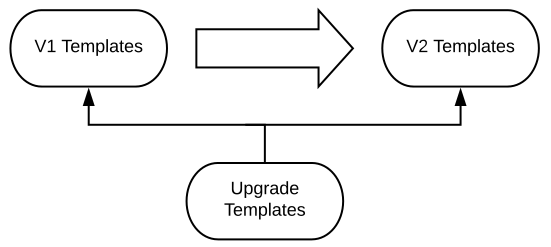
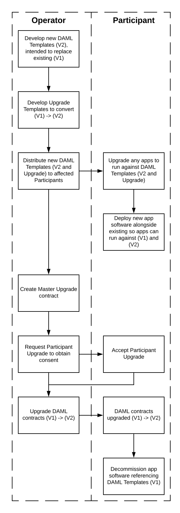

# Outdated

This repo is outdated. It is kept online to avoid broken links, but it will no longer be updated. Please refer to the [current documentation](https://docs.daml.com) for instructions on how to upgrade DAML models post-1.0.

**************************************
Upgrading DAML Templates and Contracts
**************************************

::

  Copyright (c) 2019, Digital Asset (Switzerland) GmbH and/or its affiliates. All rights reserved.
  SPDX-License-Identifier: Apache-2.0

When you create DAML contracts and templates for a business process or workflow, you may need to upgrade them when the process or workflow itself changes.

To help you understand how you might change a workflow, this page goes through an example of how to upgrade two templates (and the contracts on the ledger based on them).

In an upgrade like this, contracts on the ledger stay as they are, but are no longer active. New contract templates are used going forward, but only once accepted by the appropriate participants: where participants were signatories to the original contracts, they must approve changes before their contract can be upgraded.

The Scenario for This Example
=============================

In the example on this page, the `Operator <Parties_>`_ is an `Derivatives Exchange`_ operator. They want to change two aspects of their current model: their equity symbol contracts and their option type contracts.

For explanations of the terms used in the example, see `In The Money <In The Money_>`_.

Note: This example focuses on upgrading DAML templates and contracts, not on the processes that govern the derivatives market. The templates here are just small fragments of the actual DAML models used by the derivatives exchange and its clearing house participants.

Equity Symbol Contracts
-----------------------

* At the moment (V1)
    The `Operator <Parties_>`_ maintains a list of equity symbols, which are the underlying instruments of the `Stock Option`_ it lists. They use exactly three characters for each equity symbol: for example, "XYZ" for The XYZ Company.
* What they want to change (V2)
    Relax the three character constraint, and allow names that will range from three to five characters long.
* The DAML contracts
    There is one equity symbol contract instance for each underlying symbol. The Operator is the only signatory to the contracts. The Operator discloses the contracts to all `Participants <Parties_>`_: they are observers to all instances.

    V1 equity symbol contracts enforce three characters for the symbol. V2 enforce between three and five characters.

Option Type Contracts
---------------------

* At the moment (V1)
    The Operator lists the `equity options (Puts and Calls) <Stock Option_>`_ that trade on its exchange.

    When an option contract reaches its expiration date, if it is `in the money <In The Money_>`_ by more than 1.5% of the option's strike price, it is automatically exercised. 1.5% is a limit set by the exchange for all contracts and cannot be changed.
* What they want to change (V2)
    Allow `Participants <Parties_>`_ to set their own exercise limit for each option type.
* The DAML contracts
    Both the the Operator and the Participant are signatories on option type contracts. There is one contract instance per Participant, symbol and option type (put or call).

    V2 option type templates have the option exercise limit as an extra field (not present in V1). They give a choice to the Participant to change the default value of 1.5% to a limit they choose.

The Upgrade Process
===================

To upgrade all the V1 contracts to V2 contracts, the Operator needs to create an upgrade process using DAML templates. The upgrade process introduces the new DAML templates and migrates the existing active contract set to the new one.

The process must:

* upgrade the Operator itself
* upgrade each Participant independently
* be able to roll back in case it is deemed necessary by the Operator
* maintain a continuous service
* achieve consistency across the distributed network

Note: As the ledger construct is immutable and append-only, the ledger is not actually "rolled back" or "unwound". Instead, the contracts are just "downgraded" to their previous version, by creating new instances that preserve the initial data.

A DAML Model for Upgrading
--------------------------

The Operator needs three sets of templates for the upgrade:

* The V1 Templates
    The DAML templates currently being used by the Operator and the Participants. In subfolder V1.
* The V2 Templates
    The DAML templates to use after the upgrade process completes. In subfolder V2.
* The Upgrade Templates
    In subfolder Upgrade. These are:

    * A Master Upgrade template
        This is owned by the Operator. It's used to orchestrate the upgrade (or rollback).
    * A Participant Upgrade template
        For contracts where the Participant is a signatory, this allows Participates to delegate the right to the Operator to upgrade (or rollback) contracts.
    * Upgrade and Rollback templates
        These describe the transition of each V1 template to V2, and V2 back to V1.

The V1 and V2 Templates are independent of each other. The Upgrade Templates reference both V1 and V2.

Notes on Timing
---------------

This page only covers the design and implementation of the Upgrade Templates, and the process which upgrades the existing contracts.

It does not cover the process of rolling templates out to ledgers, but here is a brief discussion of this process.

Most of the upgrade process does not need to happen simultaneously for all Participants. Only one process does: upgrading active contract instances of affected workflows to the new template version.

This means V1 and V2 contract instances will co-exist on the ledger, until everything has been upgraded to V2 and all V1 instances have been archived. The templates carrying out the upgrade will also be active on the ledger; they can be created and archived on an ad-hoc basis.

Upgrading business logic on distributed systems is a non-trivial task. When a distributed DAML-based system is upgraded, the changes that affect the communication protocol between the nodes (the GSL) and the content of that communication (Core Transactions and DAML) require coordination between participants.

DAML Templates for the Upgrade
==============================

This section explains the DAML templates in the code for this example. Each template to be upgraded has two versions: ``V1`` and ``V2``

The EquitySymbol Template
-------------------------

The `EquitySymbol (V1) <daml/V1/Symbol.daml>`_ and `EquitySymbol (V2) <daml/V2/Symbol.daml>`_ templates contains the upgrade for information about the underlying symbol. They are issued by the Operator and disclosed to Participants using the ``observer`` mechanism. They use the ``ensure`` precondition to enforce the character limit.

The OptionType Template
------------------------

The `OptionType (V1) <daml/V1/OptionType.daml>`_ and `OptionType (V2) <daml/V2/OptionType.daml>`_ templates contains the upgrade for information about options. It is an agreement between the Operator and a Participant. V2 has a new Decimal field ``exerciseLimit : Decimal`` and a new choice ``ChangeExerciseLimit with newExerciseLimit : Decimal`` given to the Participant.

The UpgradeSymbol and UpgradeOptionType Templates
-------------------------------------------------

These upgrade templates contain the rules of how to upgrade ``EquitySymbol`` and ``OptionType`` contract instances from V1 to V2. Each of these is done by a separate template instance:  `UpgradeSymbol <daml/Upgrade/Upgrades.daml#L37-L58>`_, and `UpgradeOptionType <daml/Upgrade/Upgrades.daml#L61-L89>`_

The signatories of these contracts match the signatories of the contracts that they are upgrading. They are created by the Operator, and have an choice. The non-consuming ``Upgrade`` choice acts as a converter, taking a V1 contract instance and returns a V2 instance. Specifically, it:

1. Fetches the data from V1.
2. Archives V1.
3. Creates a V2 instance with that same data.

Once all contracts of V1 are passed through the ``Upgrade`` choice, the Operator can then archive the Upgrade contract.

``OptionType`` 's new ``exerciseLimit`` field is initialized with the ``presetExerciseLimit`` of 1.5% `by this choice <daml/Upgrade/Upgrades.daml#L70-L80>`_.

The process described above also applies for rolling back. Just like ``UpgradeSymbol`` and ``UpgradeOptionType``, the corresponding `RollbackSymbol <daml/Upgrade/Rollbacks.daml#L38-L75>`_ and `RollbackOptionType <daml/Upgrade/Rollbacks.daml#L78-L118>`_ have a ``Rollback`` non-consuming choice, that accepts an instance of V2, fetches its data, archives it and yields a V1 version.

The MasterUpgrade Template
--------------------------

The `Master <daml/Upgrade/Master.daml>`_ upgrade contract is created and owned by the Operator. It is responsible for orchestrating the upgrade process, and executing batch upgrades to operator-only owned contracts (such as ``EquitySymbol`` instances).

The master upgrade contract cannot be used to batch upgrade contracts where the Participant is a signatory. The Operator cannot force Participants into contracts or change the templates that parties have agreed to.

Instead, it must obtain their prior consent. In this case, it uses the `RequestParticipantUpgrade <daml/Upgrade/Master.daml#L42-L50>`_ choice to invite Participants to delegate their right to an upgrade. This leads to the creation of a `ParticipantUpgradeRequest <daml/Upgrade/Participant.daml#L94-L107>`_ contract instance which allows the Participant to authorizes the Operator to update by an `Accept <daml/Upgrade/Participant.daml#L102-L107>`_ choice on that contract.

Choices to the ``MasterUpgrade`` contract are non-consuming: they can be executed multiple times. The Operator can choose the "batch size" - how many instances of ``EquitySymbol`` contracts are added to a list - depending on the number of the contract instances to be converted. This is passed as an argument to the choice that upgrades them (or rolls them back).

The ParticipantUpgrade Template
-------------------------------

The `ParticipantUpgrade <daml/Upgrade/Participant.daml>`_ contract instance authorizes the Operator to perform an upgrade (or rollback) to the ``OptionType`` contract instances where the Participant is a signatory. The equivalent batching paradigm applies here as well.

The SymbolRollbackConflict and OptionTypeRollbackConflict Templates
-------------------------------------------------------------------

When rolling back, there may be instances of the ``EquitySymbol`` and ``OptionType`` templates which reference symbols of more than three characters. These symbols are not valid in V1.

If you try to roll back a ``EquitySymbol`` contract which is not compatible with V1, a `SymbolRollbackConflict <daml/Upgrade/Rollbacks.daml#L121-L145>`_ is created. This contract preserves the original data and allows the Operator to resolve the conflict. It can either ``ResolveConflict with symbol : Text`` (specifying a valid symbol name) or  ``Archive`` the data. The `OptionTypeRollbackConflict <daml/Upgrade/Rollbacks.daml#L148-L175>`_ takes a similar approach.

The Operator and ClearingParticipantInvitation Templates
--------------------------------------------------------

These DAML templates are not instrumental to the upgrade process: they are here to make this example work. They create the contract instances that will be converted during the upgrade workflow, and demonstrate that the upgrade has taken place.

The `Operator <daml/V1/Operator.daml>`_ template contract is used by the Operator to create new ``EquitySymbol`` instances using the `RegisterSymbol <daml/V1/Operator.daml#L17-L28>`_ choice. The Operator may also exercise the `OnboardClearingParticipant <daml/V1/Operator.daml#L33-L40>`_ choice to yield a `ClearingParticipantInvitation <daml/V1/ClearingParticipant.daml>`_ instance.

Since the ``Operator`` template references the ``EquitySymbol`` template (which gets upgraded to V2), the ``Operator`` template also needs upgrading. That way, after the upgrade completes, the Operator will be able to register symbols of the V2 ``EquitySymbol`` template.

When a Participant accepts a ``CleringParticipantInvitation``, it generates the set of ``OptionType`` contracts for that Participant. Although you could, there is no need to provision for upgrading instances of the ``ClearingParticipantInvitation`` templates:

Contracts of this template are likely to be short lived, because they are used for the sole purpose of onboarding a Participant to the exchange. Before an upgrade takes place, the Operator can simply archive any outstanding instances of ``ClearingParticipantInvitation`` that have not been Accepted.

Running Through the Upgrade Scenario
====================================

``UpgradeExample.daml`` includes a scenario for an end-to-end upgrade and rollback workflow between the Operator and two Participants.

1. Set Up Parties: The DAML Parties that will be involved in the workflow are `given names <daml/UpgradeExample.daml#L26-L30>`_ and `created <daml/UpgradeExample.daml#L70-L75>`_
2. Set Up Demo Data: `DemoData.daml <daml/DemoData.daml>`_ includes the sample data used in the workflow:
3. Onboard Participants: The Operator `creates a role contract and registers symbols <daml/UpgradeExample.daml#L80-L96>`_. Then they `onboard <daml/UpgradeExample.daml#L98-L113>`_ the two Participants.
4. Upgrade to V2: The setup is now operating in version V1. To transition to V2, the Operator commences the `upgrade workflow <daml/UpgradeExample.daml#L116-L188>`_
5. Verify the Upgrade: All contracts are now upgraded to V2. `This step <daml/UpgradeExample.daml#L190-L218>`_ checks:

* if the Operator can register a symbol that is four characters long
* if a Participant can change the exercise limit

6. Roll Back: The previous step verified that the setup is now on V2. The Operator now tries `rolling back <daml/UpgradeExample.daml#L222-L280>`_ the system to V1. 

* The Operator doesn't need a confirmation from each Participant in order to roll back: they already gave this authorization to the Operator by accepting the ``ParticipantUpgradeRequest``. 
* Since the Operator has registered the "ACME" symbol (which cannot exist in V1 because it contains four characters), there will be a conflict. This step resolves the conflict by providing a three character version of the symbol ("ACM").

7. Verify the Rollback: All contracts are now rolled back. `This step <daml/UpgradeExample.daml#L282-L300>`_ checks:

* the Operator can no longer register a symbol that does not contain three characters
* the new "ACM" ``EquitySymbol`` contains all information from its V2 counterpart other than the symbol name

Terminology
============

This example takes place in the derivatives trading realm.

Parties
-------

The parties in the example are:

* The Operator
    One equity derivatives exchange operator.
* The Participants
    Multiple options clearing houses that are participants to the exchange.

Derivatives Exchange
--------------------

A *derivatives exchange* is an organization that provides a central marketplace where derivative contracts, such as stock options, trade.

Options Clearing House
----------------------

An options clearing house is an organization that acts as an intermediary between buyers and sellers of options contracts on a derivatives exchange.

The clearing house will take the opposite position of each side of a trade. The purpose of this is to improve the efficiency of the markets and add stability to the financial system.

Equity Derivative
-----------------

An *equity derivative* is a financial instrument. Its value is derived from the price movements of an underlying equity.

For example, a stock option contract (see below) is an equity derivative because its value is determined by the price movements of the underlying stock.

Stock Option
------------

A *stock option* is an equity derivative that gives the buyer the right, but not the obligation, to buy or sell the underlying stock at an agreed upon price (the *strike price*). The buyer can exercise this right at most once within a certain period of time (until the *expiration date*).

This example has two types of stock options:

* A call option
    This gives the buyer the right to **buy** a stock at the strike price (before the expiration).
* A put option
    This gives the buyer the right to **sell** a stock at the strike price (before the expiration).

In The Money
------------

Being *in the money* means that it may worthwhile for the buyer to *exercise* (make use of their right) the option.

* For a call option
    Being in the money means that the price of the option's underlying asset is **above** the call option's strike price.
* For a put option
    Being in the money means that the price of the option's underlying asset is **below** the put option's strike price.
